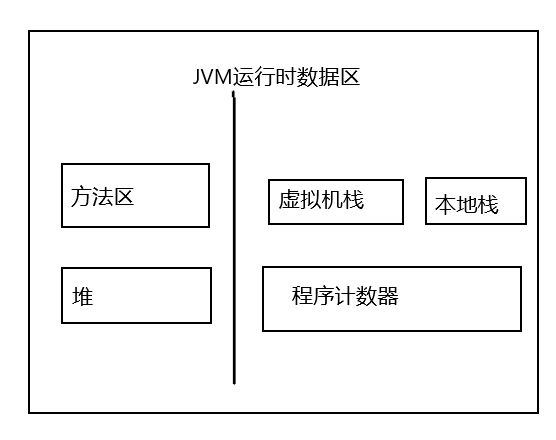

## 内存管理

对于Java程序员来说，在虚拟机自动内存管理机制的帮助下，不再需要为每一个new操作去写配对的delete/free代码，不容易出现内存泄漏和内存溢出问题，由虚拟机管理内存这一切看起来都很美好，不过也正是因为Java程序员把内存控制的权力交给了Java虚拟机，一旦出现内存泄漏和溢出方面的问题，如果不了解虚拟机时怎样使用内存的，那么排查错误将会成为一项异常艰难的工作。

### 运行时数据区域

#### 程序计数器(Program Counter Register)

一块较小的内存空间，时当前线程所执行的字节码的行号指示器。在虚拟机的概念模型里，字节码解释器工作时就是通过改变这个计数器的值来选取下一条需要执行的字节码指令，分支，循环，跳转，异常处理，线程恢复等基础功能都需要依赖这个计数器来完成。每个线程都有一个独立的程序计数器，各条线成之间计数器互不影响独立存储，这类内存区域为“线程私有”。如果线程执行的时一个Java方法，这个计数器记录的是正在执行的虚拟机字节码指令的地址，如果正在执行的是native方法，这个计数器值则为空。

此内存区域是唯一一个在Java虚拟机规范中没有规定任何OutOfMemoryError情况的区域。

#### Java虚拟机栈(Java virtual machine stacks)

生命周期与线程相同，是线程私有的。栈描述的是Java方法执行的内存模型，每个方法在执行的同时都会创建一个栈帧(Stack Frame)用于存储局部变量，操作数栈，动态链接，方法出口等信息，每个方法从调用直至执行完成的过程，就对应着一个栈帧在虚拟机栈种入栈到出栈的过程。局部变量表存放了编译器可知的各种基本数据类型(boolean,byte,char,short,int,float,long,double)，对象引用和returnAddress类型

这个区域规定了两种异常情况。StackOverflowError异常，即如果线程请求的栈深度大于虚拟机所允许的深度；OutOfMemoryError异常，虚拟机栈可以动态扩展，如果扩展时无法申请到足够的内存。

#### 本地方法栈(Native method stack)

与Java虚拟机栈类似，不过它是为虚拟机使用到的native方法服务。HotSpot将本地方法栈和虚拟机栈合二为一。

也会抛出StackOverflowError和OutOfMemoryError。

#### Java堆

Java虚拟机所管理的内存种最大的一块，Java堆是被所有线程共享的一块内存区域，在虚拟机启动时创建。此内存区域唯一目的就是存放对象实例，几乎所有的对象实例都在这里分配内存。Java堆是垃圾收集器管理的主要区域。堆分为老年代和新生代，有Eden空间，From Survivor空间，To Survivor空间，线程共享的Java堆可能划分出了多个线程私有的分配缓冲区(Thread Local Allocation Buffer)。

Java堆通过-Xmx，-Xms控制大小。OutOfMemoryError，如果在堆种没有内存完成实例分配，并且堆也无法再扩展时。

#### 方法区(Method Area)

与堆一样是各个线程共享的内存区域，它用于存储已被虚拟机加载的类信息，常量，静态变量，及时编译器编译后的代码等数据。HotSpot Java7中，用永久代来实现了方法区。

Java通过-XX:MaxPermSize来控制大小。OutOfMemoryError，当方法区无法满足内存分配需求时。

#### 运行时常量池(Runtime constant pool)

时方法区的一部分，Class文件中除了有类的版本，字段，方法，接口等描述信息外，还有一项是常量池，用于存放编译器生成的各种字面量和符号引用，这部分内容将再类加载后进入方法去的运行时常量池存放。

受到方法区内存的限制，当常量池无法再申请到内存时会抛出OutOfMemoryError异常。

#### 直接内存(Direct Memory)

Java针对一些场景，需要正在直接再本地进程的堆中分配内存。比如NIO的DirectByteBuffer，可以避免再Java堆和native堆中来回复制数据，显著提高性能。

OutOfMemoryError，受到物理内存的限制，无法动态扩展时抛异常。

### 垃圾收集与内存分配策略

 #### 对象是否可回收

* 引用计数算法，给对象添加一个引用计数器，每当一个地方引用它时，计数器值就加1，当引用失效时，计数器值就减1，任何时刻计数器0的对象就是不可能在被使用的
* 可达性分析算法，Java使用可达性分析来判定对象是否存活的，这个算法基本思想就是通过一系列称为“GC Roots"的对象作为起点，从这些阶段开始向下搜索，搜索所走过的路径被称为引用链，当一个对象到GC Roots没有任何引用链相连时，则证明此对象时不可用的。Java中可作为GC Roots的对象包括，虚拟机栈中引用的对象，方法区中类静态属性引用的对象，方法区中常量引用的对象，本地方法栈中JNI引用的对象。

#### Java中的引用

* 强引用，程序代码中普遍存在的类似”Object o = new Object()“这类直接赋值的引用，只要强引用还存在，垃圾收集器永远不会回收掉被引用的对象。
* 软引用，描述一些还有用但并非必须的对象。对于软引用关联着的对象，再系统将要发生内存溢出异常之前，将会把这些对象列进回收范围之中进行第二次回收，如果第二次回收还没有足够的内存，才会抛出内存溢出异常。SoftReference。
* 弱引用，描述非必须对象，但是它的强度比SoftReference更弱一些。被弱引用关联的对象只能生存到下一次垃圾收集发生之前，当垃圾收集工作时无论当前内存是否足够，都会回收掉只被弱引用关联的对象。WeakReference。
* 虚引用，也被称为幽灵引用或者幻影引用，他是最弱的一种引用关系。一个对象是否有虚引用的存在，完全不会对其生存时间构成影响，也无法通过虚引用来取得一个对象实例，为对象设置虚引用关联的唯一目的就是能在这个对象被收集器回收时收到一个系统通知。PhantomReference。

#### 生存还是死亡

即使再可达性分析算法中不可达的对象，也并非是”非死不可“的，这时候它们处于”缓刑“阶段，要真正宣告一个对象死亡，至少要经历两次标记过程，如果对象再进行可达性分析后发现没有与GC Roots相连接的引用链，那它将会被第一次标记并且进行一次筛选，筛选的条件是此对象是否有必要执行finalize()方法，当对象没有覆盖finalize()方法，或者finalize()方法已经被虚拟机调用过，则没必要执行。

#### 垃圾收集算法

* 标记-清除算法(Mark-Sweep)，标记->清除两个阶段，首先标记出所有需要回收的对象，在标记完成后统一回收所有被标记的对象。两个不足：效率问题，标记和清除两个过程的效率都不高；空间问题，标记清除过后会产生大量不连续的内存碎片，空间碎片太多可能导致以在程序运行过程中需要分配较大对象时，无法找到足够的连续内存而不得不提前触发另一次垃圾收集动作。
* 复制算法，为了解决效率问题，复制算法出现了，它将可用内存按容量划分为大小相等的两块，每次只使用其中的一块，当这一块的内存用完了，就将还存活的对象复制到另外一块上面，然后再把已经使用过的内存空间一次清理掉。这样使得每次都是堆整个半区进行内存回收，内存分配时也就不用考虑内存碎片等复杂情况。现在的商业虚拟机都采用这种收集算法来回收新生代。
* 标记-整理算法(Mark-Compact)，复制算法在对象存货率较高时就要进行较多的复制操作，效率将会变低。根据老年代提出了标记-整理算法。分为标记整理两个过程，整理过程是将所有存活的对象都向一端移动，然后直接清理掉端边界以外的内存。
* 分代收集算法，就是根据对象存活周期，将Java堆分为新生代和老年代。这样根据各个年代的特点采用适当的收集算法，在新生代每次垃圾收集时都发现有大批对象死去，只有少量存活那就选用复制算法。而老年代中因为对象存货率高，没有额外空间对象进行分配担保，就必须使用”标记-整理“或者”标记-清除“算法来进行回收。

HotSpot中新生代的回收，将新生代分为了Eden，From Survivor，To Survivor三块空间按8：1：1分配。每次使用Eden和其中一块Survivor，将Eden和Survivor中还存活的对象一次性复制到另外一块Survivor空间上，最后清理掉Eden和刚才用过的Survivor空间。这样实际上在HotSpot的新生代中我们可用的呢次空间为整个新生代的90%。如果出现新生代留下的对象超过10%这种情况，一块Survivor就不够存放，这是需要依赖其它内存(老年代)进行担保分配。

#### HotSpot的算法实现

1. 枚举根节点GC Roots
2. 安全点
3. 安全区域

#### 垃圾收集器

1. Serial收集器
2. ParNew收集器
3. Parallel Savenge收集器
4. Serial Old收集器
5. Parallel Old收集器
6. CMS收集器
7. G1收集器

#### 内存分配与回收策略

* 

## 参考

* 《深入理解Java虚拟机》