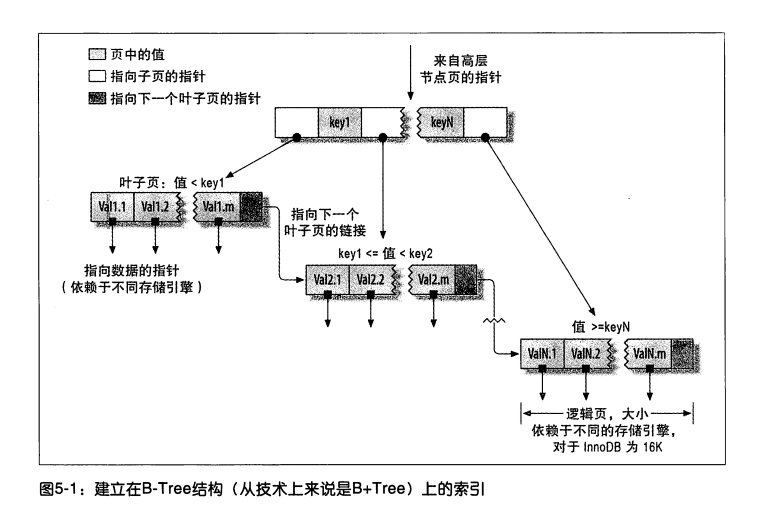
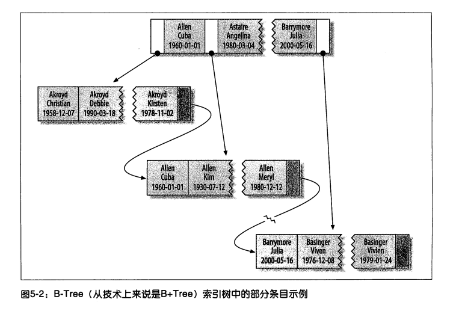
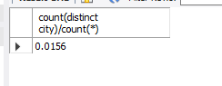
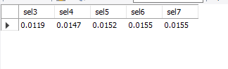

## MySQL服务

> 存储引擎

* InnoDB  MySQL默认事务型存储引擎，被设计用来处理大量短期事务。采用MVCC支持高并发，实现了4个标准的隔离级别，默认级别为REPEATABLE READ，通过间隙锁策略防止幻读。
* MyISAM 
* memory

> 转换表的存储引擎

* alter table table_name engine = InnoDB;
* 导出->导入
* create table new_engine_table like old_engine_table;

​       alter table new_engine_table engine=new_engine;

​       insert into new_engine_table select * from old_engine_table; 

### 数据类型

* 更小的通常更好，占用更少的磁盘，内存和CPU缓存，处理时需要的CPU周期也更少
* 简单就好，简单的数据类型的操作通常需要更少的CPU周期
* 尽量避免NULL

### scheme

* 太多的列
* 太多的关联
* 全能的枚举
* 变相的枚举
* 非此发明的NULL

### 范式和反范式

范式：

* 范式化的更新操作通常比反范式化要快
* 当数据较好的范式化时，就只有很少或者没有重复数据，所以只需要修改更少的数据
* 范式化的表通常更小，可以更好的放在内存中，所以执行操作会更快
* 很少有多余的数据意味着检索列表数据时更少需要DISTINCT或者GROUP BY语句

> 范式化设计的缺点时通常需要关联，稍微复杂一些的查询语句在符合范式的scheme上都可能需要至少一次关联。

反范式：

* 反范式化的schema因为所有数据都在一张表中，可以很好的避免关联
* 单独的表也能使用更有效的索引策略

> 如果不需要关联表，则对大部分查询最差的情况，即使表没有使用索引——使用全表扫描，当数据比内存大时这可能比关联要快的多，因为这样避免了随机IO。
>
> 全表扫描基本上时顺序IO，但也不是100%的，跟引擎的实现有关。

> 更快的读，更慢的写。为了提升读查询的速度，经常会需要建一些额外索引，增加冗余列，甚至是创建缓存表和汇总表。这些方法会增加写查询的负担，也需要额外的维护任务，但在设计高性能数据库时，这些都是常见的技巧：虽然写操作变得更慢了，但显著的提高了读操作的性能。

## 索引

索引时存储引擎用于快速找到记录的一种数据结构，索引对于良好的性能非常关键。索引优化应该是对查询性能优化最有效的手段了，索引能够轻易将查询性能提高几个数量级。

### 索引基础

例：

```mysql
select first_name from sakila.actor where actor_id = 5;
```

如果actor_id列上建有索引，则MySQL将使用该索引找到actor_id为5的行，也就是说MySQL现在索引上按值进行查找，然后返回所有吧包含该值的数据行。另外，索引可以包含一个列或多个列的值，如果索引包含多个列，那么列的顺序也十分重要，因为MySQL只能高效的使用索引的最左前缀列。

### 索引类型

#### B-Tree

InnoDB使用的时B+树。存储引擎以不同的方式使用B-Tree索引，性能也各有不同。如，MyISAM使用前缀压缩技术使得索引更小通过数据的物理位置引用被索引的行，但InnoDB则按照原数据格式进行存储，根据主键引用被索引的行。下图展示了B-Tree索引的抽象表示，大概反映了InnoDB索引时如何工作的。



B-Tree索引能够加快访问数据的速度，因为存储引擎不再需要进行全表扫描来获取需要的数据，取而代之的是从索引的根节点开始进行搜索根节点的槽总存放了指向子节点的指针，存储引擎根据这些指针向下层查找，通过比较节点页的值和要查找的值可以找到合适的指针进入下层子节点， 这些指针实际上定义了子节点页中值的上限和下限，最终存储引擎要么是找到对应的值，要么该记录不存在。叶节点比较特别，它们的指针指向的是被索引的数据。根节点和叶子节点之间可能有很多层节点页，树的深度和表的大小直接相关。B-Tree对索引是顺序组织存储的，所以很适合查找范围数据。

例：

```mysql
create table people (
	last_name varchar(50) not null,
	first_name varchar(50) not null,
	dob date not null,
	gender enum('m', 'f') not null,
	key sample_idx (last_name, first_name, dob)
);
```

索引sample_idx的结构如图



B-Tree索引适用于全键值，键值范围或键前缀查找。能够有效使用sample_idx的查询如下：

1. 全值匹配，查询条件和索引的所有列匹配
2. 匹配最左前缀，查询last_name = Aleen的人，只使用索引的第一列
3. 匹配列前缀，查询last_name以'J'开头的，只使用了索引第一列
4. 匹配范围值，查询last_name范围为Allen和Barrymore之间的，只使用了第一列
5. 精确匹配某一列并范围匹配另外一列，
6. 只访问索引的查询，即需要的数据列和查询条件列全部被索引覆盖，存储引擎只需通过访问索引就可以的到所有数据。

因为索引树种的节点是有序的，所以除了按值查找外，还可用于查询中的ORDER BY操作。

限制：

* 如果不是按照索引的最左列开始查找，则无法使用索引
* 不能跳过索引中的列
* 如果查询中有某个列的范围查询，则其右边所有列都无法使用索引优化查找

索引列的顺序非常重要，上面关于索引有效性的限制都和索引顺序有关。

#### 哈希索引

基于哈希表实现，只有精确匹配索引的所有列。存储引擎对索引的列建立hash code，并存储在哈希索引中，同时保存了指向每个数据行的指针。MySQL中只有Memory引擎显示支持哈希索引，它也支持B-Tree索引，且Memory使用哈希索引作为默认索引，用链接法解决了哈希冲突。

例：

```mysql
create table testhash (
 fname varchar(50) not null,
 lname varchar(50) not null,
 key hash_idx(fname) using hash
) engine=memory;
```

针对*select lname from testhash where fname = 'Peter'*，MySQL先计算查询条件的哈希值，并查找索引中对应的记录，找到后，再比较值是否相同。

限制：

* 哈希索引只包含哈希值和行指针，而不存储字段值，所以不能使用索引中的值来避免读取行。
* 哈希索引数据并不是按照索引值顺序存储的，所以也就无法用于排序
* 哈希索引也不支持部分索引列匹配查找，因为哈希索引始终是使用索引列的全部内容来计算哈希值的
* 哈希索引只支持等值比较查询，包括=，in()，<=>，不支持任何范围查询
* 访问哈希索引的数据非常快，除非有很多哈希冲突
* 如果哈希冲突很多的话，一些索引维护操作的代价也会很高

> 因为这些限制，哈希索引只适用于某些特定的场合，而一旦适合哈希索引，则它带来的性能提升非常显著。
>
> InnoDB引擎有一个特殊的功能叫做自适应哈希索引，当InnoDB注意到某些索引值被使用得非常频繁时，它会在内存中基于B-Tree索引之上在创建一个哈希索引，这样就让B-Tree索引也具有一些哈希索引的优点了。

#### 空间数据索引

MyISAM表支持空间索引，可以用作地理数据存储。

#### 全文索引

他查找的时文本中的关键词，而不是直接比较索引中的值，全文索引适用于MATCH AGAINST操作，而不是WHERE条件操作。


### 索引的优点

B-Tree索引可以用于加速查询，用来做ORDER BY和GROUP BY，如果查询的字段只包括索引列，则直接通过索引就可以查询所需数据。

* 索引大大减少了服务器需要扫描的数据量
* 索引可以帮助服务器避免排序和临时表
* 索引可以将随机IO变为顺序IO

### 高性能索引策略

#### 独立地列

索引是独立的列，索引列不能是表达式的一部分，也不能是函数的参数。

例中，索引列其实会失效：

```mysql
select actor_id from actor where actor_id + 1 = 5;
select  ... where to_days(current_date) - to_days(date_col) <= 10;
```

#### 前缀索引和索引选择性

如果需要索引很长的字符串，这会让索引大且慢，可以通过模拟哈希索引来避免索引整个字符串，或者使用前缀索引——索引字段开始的部分字符串。

索引选择性：不重复的索引值和记录总数的比值，返回从1/#T到1之间，索引的选择性越高则查询效率越高。比如，唯一索引的选择性是1。

前缀索引的例子：

```mysql
#初始化数据
create table city_demo(city varchar(50) not null);
insert into city_demo(city) select city from city;
insert into city_demo(city) select city from city_demo;
update city_demo set city = (select city from city order by rand() limit 1);

#尝试对city字段选择性做预估
select count(*) as cnt, city 
from city_demo group by city order by cnt desc limit 10;
select count(*) as cnt, left(city, 7) as pref 
from city_demo group by pref order by cnt desc limit 10;

#计算city字段索引选择性
select count(distinct city)/count(*) from city_demo;

#计算前缀索引选择性
select count(distinct left(city, 3))/count(*) as sel3,
count(distinct left(city, 4))/count(*) as sel4,
count(distinct left(city, 5))/count(*) as sel5,
count(distinct left(city, 6))/count(*) as sel6,
count(distinct left(city, 7))/count(*) as sel7
from city_demo;
```

索引选择性计算如图，我们可以得出，前缀长度用6就够了。






有时后缀索引也有用途，但MySQL不支持，可以把字符串反转后存储，并基于此建立前缀索引。

#### 多列索引

MySQL再5.0以后的版本引入了一种叫做“索引合并”的策略用于，再多个列上单独创建了索引这种情况。适用于：OR或AND条件查询。索引合并策略有时候是一种优化的结果，但实际上更多时候说明了表上的索引建的很糟糕：

* 当出现服务器对多个索引做相交操作时（通常多个AND），通常意味着需要一个包含所有相关列的多列索引，而不是多个独立的单列索引
* 当服务器需要对多个索引做联合操作时（通常多个OR），通常需要消耗大量CPU和内存资源在算法的缓存，排序和合并操作上。特别是当其中有些索引的选择性不高，需要合并扫描返回的大量数据的时候
* 更重要的是，优化器不会把这些计算到查询成本中，优化器只关心随机页面读取。

#### 聚簇索引

聚簇索引并不是一种单独的索引类型，而是一种数据存储方式。聚簇表示数据行和相邻的键值紧凑的存储在一起。因为无法同时把数据行存放在两个不同的地方，所以一个表只能由一个聚簇索引。

InnoDB通过主键聚集数据，如果没有主键则选择一个唯一的非空索引代替，如果没有，则会隐式的定义一个主键来作为聚簇索引。

聚簇索引的一些优点：

* 可以把相关数据保存在一起。
* 数据访问更快。
* 使用覆盖索引扫描的查询可以直接使用叶节点中的主键值。

聚簇索引的一些缺点：

* 聚簇数据最大限度地提高了I/O密集型应用的性能，但如果数据全部都放在内存中，则访问的顺序就没那么重要了，聚簇索引也就没什么优势了。
* 插入速度严重依赖于插入顺序
* 更新聚簇索引列的代价很高，因为会强制InnoDB将每个被更新的行移动到新的位置。
* 基于聚簇索引的表在插入新行，或者主键被更新导致需要移动行的时候，可能面临页分裂。
* 聚簇索引可能导致全表扫描变慢，尤其是行比较稀疏，或者由于页分裂导致数据存储不连续的时候。
* 二级索引可能比想象的要更大，因为在二级索引的叶子节点包含了引用行的主键列。
* 二级索引访问需要两次索引查找，而不是一次。二级索引叶子节点保存的不是指向行的物理位置的指针，而是行的主键。

#### 覆盖索引

MySQL可以使用索引来直接获取列的数据，这样就不再需要读取数据行，这种包含所有需要查询的字段的值，我们就称之为覆盖索引。

覆盖索引能极大的提高性能，好处：

* 索引条目通常远小于数据行大小，这样只读取索引，可以极大的减少数据访问量。
* 因为索引是按照列顺序存储的，所以对于I/O密集型的范围查询会比随机从磁盘读取每一行数据的I/O要少的多。
* 一些存储引擎如MyISAM在内存中只缓存索引，数据则依赖于操作系统来缓存，因此要访问数据需要一次系统调用。
* 由于InnoDB的聚簇索引，覆盖索引对InnoDB表特别有用，InnoDB的二级索引在叶子节点中保存了行的主键值，所以如果二级索引能够覆盖查询，则可以避免对于主键索引的二次查询。

覆盖索引必须存储列的值，而哈希索引，空间索引和全文索引等都不存储索引列的值，所以MySQL只能使用B-Tree索引做覆盖索引。

#### 使用索引扫描来做排序

MySQL有两种方式生成有序结果：通过排序操作，或者按索引顺序扫描。MySQL可以使用同一个索引既满足排序有用于查询，如果可能设计索引是应该尽可能地同时满足这两种任务。

## 查询性能优化

查询优化的是响应时间，如果把查询看作是一个任务，那么它由一系列子任务组成，每个子任务都会消耗一定的时间。优化查询，实际上要优化其子任务，要么消除其中一些子任务，要么减少子任务的执行次数，要么让子任务运行的更快。

最简单的衡量查询的3个指标：1.响应时间，2.扫描的行数，3.返回的行数

SQL->查询缓存->解析器->解析树->预处理器->解析树->查询优化器->查询执行计划->查询执行引擎->存储引擎->查询缓存->返回

## 附录.A MySQL

MySQL官方有个自带的测试数据库，叫employees，超过30W用户数据。

具体参考：https://github.com/datacharmer/test_db