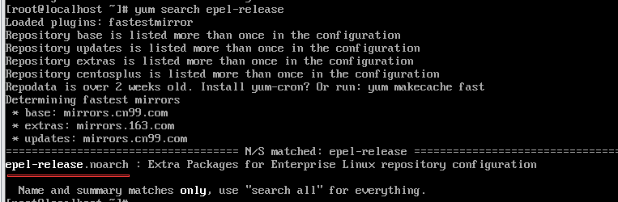
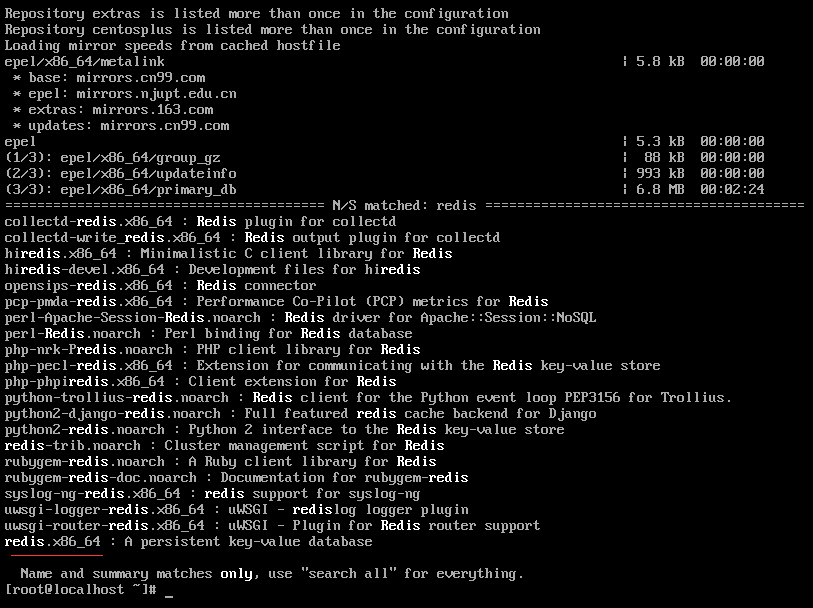
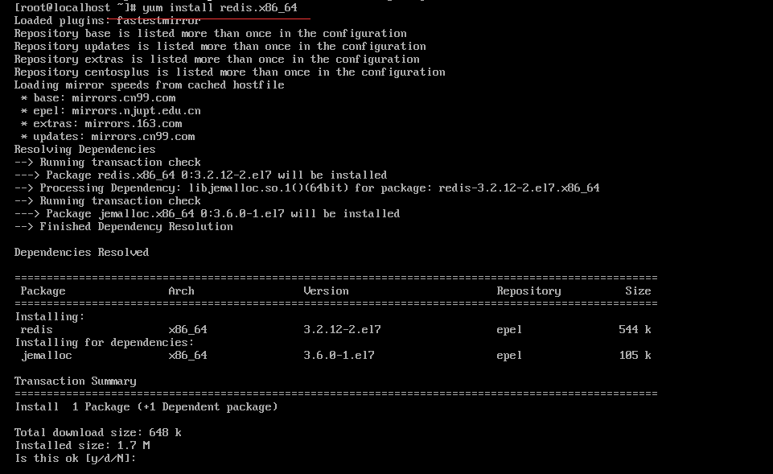
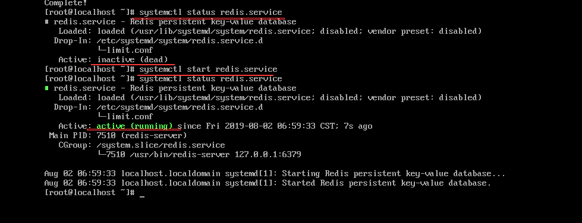
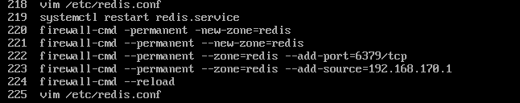

# Redis

## centos7 redis安装

```shell
#安装EPEL yum源
yum install epl-release
#查询可用的yum安装
yum search redis
#安装
yum install redis.x86_64
#启动redis服务
systemctl start redis.service
#检查redis service状态
systemctl status redis.service
#开机启动redis service
systemctl enable redis
```

具体过程：

* 查询及安装epel源




* 安装redis






* 维护redis service

  

* linux——centos7，安装redis防火墙策略配置

  

## redis

### redis数据结构

| 结构类型 | 结构存储的值                     | 结构的读写能力 |
| -------- | -------------------------------- | -------------- |
| String   | 可以是字符串，整数或者浮点数     |                |
| list     | 一个链表                         |                |
| set      | 包含字符串的无序容器，每个值唯一 |                |
| hash     | 无序散列表                       |                |
| zset     | 有序容器                         |                |

## 持久化选项

### 快照

快照持久化：通过创建快照来获得存储在内存里面的数据在某个节点上的副本。可以对快照文件进行备份，可以将快照文件复制到其它服务器从而创建具有相同数据的服务器副本，还可以将快照留在原地以便重启服务器时使用。

创建快照的方法：

* 客户端通过向redis发送BGSAVE命令来创建快照。调用fork创建一个子进程，由子进程负责将快照写入硬盘，而父进程继续处理命令请求。
* 客户端通过向redis发送SAVE命令来创建一个快照。接到SAVE命令的redis服务器在快照创建完毕之前不再响应任何其它命令。
* 配置文件中设置了save配置选项
* 当redis通过shutdown命令接收到关闭服务器的请求时，或者就受到标准TERM信号时，会执行一个SAVE命令，阻塞所有客户端，不再执行客户端发送的命令并在SAVE命令执行完毕之后关闭服务器。
* 当一个redis服务器连接另一个redis服务器，并向对方发送SYNC命令来开始一次复制操作的时候，如果主服务器目前没有在执行BGSAVE，或者主服务器并非刚刚执行完BGSAVE命令，那么主服务器就会执行BGSAVE命令。

在只是用快照持久化来保存数据时，一定要记住，如果系统真的发生崩溃，用户将丢失最近一次生成快照之后更改的所有数据。

配置：

```text
#快照持久化选项
save 60 1000
stop-writes-on-bgsave-error no
rdbcompression yes
dbfilename dump.rdb
```

### AOF持久化

AOF持久化：将被执行的写命令写到AOF文件的末尾，以此来记录数据发生的变化，因此redis只要从头到尾重新执行一次AOF文件包含的所有写命令，就可以恢复AOF文件所记录的数据集。

配置：

```
#AOF持久化选项
appendonly no
appendfsync everysec
no-appendfsync-on-rewrite no
auto-aof-rewrite-percentage 100
auto-aof-rewrite-min-size 64m
dir ./
```

appendfsync配置选项对同步频率的影响：

* always，每个redis写命令都要同步写入硬盘，这样做会严重降低redis的速度
* everysec，每秒执行一次同步，显示地将多个写命令同步到硬盘
* no，让操作系统来决定应该何时进行写同步

> 固态硬盘和appendfsync always
>
> 使用固态硬盘应该谨慎使用appendfsync always选项，应为这个选项让redis每次只写入一个命令，而不是向其它appendfsync选项那样一次写入多个命令这种不断地写入少量数据的做法有可能会引发严重的写入放大问题。

### 使用redis构建应用

1. 使用redis来记录日志
2. 