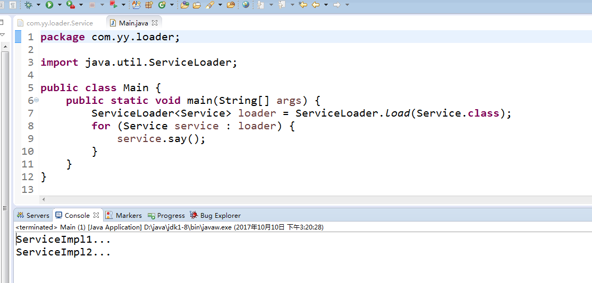
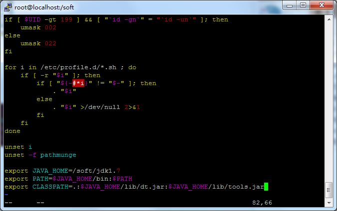

# Java

## Java中的引用

Java中对引用类型的引用强度做了细分，有这个细节是为GC考虑的。Java的GC是根据GC Roots来判断是否回收对象的。

GC Roots：

指的是一组必须活跃的引用。可以这样理解，当对象存在活跃引用时，该对象是不可回收的。

可作为GC Roots：

1、 虚拟机栈（栈帧中的本地变量表）中引用的对象

2、方法区中类静态属性引用的对象

3、方法区中常量引用的对象

4、本地方法栈中JNI（即一般说的native方法）引用的对象

**StrongReference**

StrongReference,SoftReference,WeakReference,PhantomReference

StrongReference

String tag = new String("T");

tag 就称之为强引用

我们一般都是用强引用来对对象进行引用。强引用可以直接访问目标对象，强引用所指向的对象在任何时候都不会被系统回收，强引用可能导致内存泄漏。

其余的三种相对于强引用都是弱引用，也就是他们所引用的对象只要没有强引用，就会根据条件被JVM的垃圾回收器所回收，它们被回收的时机以及用法各不相同。

**SoftReference**

SoftReference<Object> obj = new SoftReference(new Object());

软引用是用来描述一些还有用但并非必须的对象。对于软引用关联着的对象，在系统将要发生内存溢出异常之前，将会把这些对象列进回收范围之中进行第二次回收。如果这次回收还没有足够的内存，才会抛出内存溢出异常。

在弱引用中属于最强的引用，SoftReference所指向的对象，当没有强引用指向它时，会在内存中停留一段的时间，垃圾回收器会根据JVM内存的使用情况(内存的紧缺程度)以及SoftReference的get()方法的调用情况来决定是否对其进行回收。

具体使用一般是通过SoftReference的构造方法，将需要用弱引用来指向的对象包装起来，当需要使用的时候，调用SoftReference的get()方法来获取，当对象未被回收时SoftReference的get()方法会返回该对象的强引用

软引用使用get()方法取得对象的强引用从而访问目标对象

软引用所指向的对象按照JVM的使用情况来决定是否回收

软引用可以避免Heap内存不足所导致的异常

当垃圾回收器决定对其回收时，会先清空它的SoftReference，也就是说SoftReference的get()方法将会返回null，然后再调用finalize()方法，并在下一轮GC中对其真正进行回收

**WeakReference**

弱引用的特性基本与软引用相似，区别就在于弱引用所指向的对象只要进行系统垃圾回收，不管内存使用情况如何，永远对其进行回收

弱引用使用get()方法取得对象的强引用从而访问目标对象

一旦系统内存回收，无论内存释放紧张，弱引用指向的对象都会被回收

弱引用也可以避免heap内存不足所导致的异常

**PhantomReference**

虚引用无法通过get取得目标对象

主要被用来跟踪对象被垃圾回收的状态，通过查看引用队列中是否包含对象所对应的虚引用来判断它是否即将被垃圾回收，从而采取行动，它并不被期待用来取得目标对象的引用，而目标对象被回收钱，它的引用会被放入一个ReferenceQueue对象中，从而达到跟踪对象垃圾回收的作用。

为一个对象设置虚引用关联的唯一目的就是能在这个对象被收集器回收时收到一个系统通知。

虚引用永远无法使用get()方法取得对象的强引用

**引用类型介绍表**

引用类型    取得目标对象方式    垃圾回收条件    是否可能内存泄漏

强引用        直接调用        不回收        可能

软引用        get()            视内存情况回收    不可能

弱引用        get()            永远回收    不可能    

虚引用        无法取得        不回收        可能

## ServiceLoader介绍

Java的ServiceLoader实现了简单的服务发现模式。

目的：通过引入中间代理者消除对象间复杂的耦合关系，并统一管理分散的复杂耦合关系。

如图，第一部分为提供的服务接口Service和它的两个实现类ServiceImpl1和ServiceImpl2，第二部分为配置部分，需要在META-INF/services下面创建服务接口名称的文件，ServiceLoader默认从META-INF/services目录下查找配置文件，而针对一个服务接口它是使用Class<T>.getName()来获取配置文件名称的，所以配置就像第二部分。

文件内容如图，填写具体的实现类

使用如图

反编译工具

http://blog.csdn.net/u011242657/article/details/40324281 

http://jd.benow.ca/ 

## Linux JAVA_HOME配置

Vim /etc/profile

 

Source /etc/profile