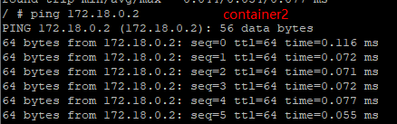

# Docker学习笔记

## 基本组成

* docker client 客户端，用来向daemon发起请求，执行相应的容器管理操作
* docker daemon 守护进程，最核心的后台进程，接受client请求并完成相应的对容器的调用
* docker image 镜像
  * 一个特殊的文件系统，提供容器运行时所需的程序，库，资源，配置等文件，还包含了一些为运行时准备的一些配置参数，镜像不包含任何动态数据，其内容在构建之后也不会被改变
  * 分层存储，
* docker container 容器
  * 容器和镜像的关系，就像OOP的类和实例一样，镜像时静态的定义，容器是镜像运行时的实体
  * 容器的实质是进程，但容器运行于属于自己的独立的命名空间
  * 每个容器运行时，是以镜像为基础层，爱其上创建一个当前容器的存储层，这个为容器运行时读写而准备的存储层为容器存储层
  * 容器存储层的生存周期和容器一样，容器消亡时，容器存储层也随之消亡，因此任何保存于容器存储层的信息都会随容器删除而丢失。容器不应该向其存储层内写入任何数据，容器存储层要保持无状态化。
* docker 镜像管理
  * distribution，上传下载镜像，存储于registry有关的元数据
  * registry，负责身份认证，镜像查找，镜像验证以及管理
  * image，负责与镜像元数据有关的存储，查找，镜像层的索引查找
  * reference 负责存储本地所有镜像的repository和tag名
  * layer 负责于镜像层和容器层元数据有关的增删改查

docker客户端/守护进程，C/S架构，客户端可以通过本地或者远程将命令发送给守护进程

镜像，容器运行的基石，容器基于镜像来启动运行。docker镜像是一个层叠的只读文件系统，

容器，是执行的基本单元，容器内可以运行一个或多个进程

仓库，仓库保存用户构建的镜像，分公有和私有


## 依赖的Linux技术

namespace 命名空间

操作系统中提供了资源的隔离，包括进程，网络，文件系统等

实现了轻量级虚拟化服务

使用了5种namespace：

1. PID 进程隔离
2. NET 管理网络接口
3. IPC 管理跨进程通信的访问
4. MNT 管理挂载点
5. UTS 隔离内核和版本标识

control groups（cgroups）控制组，限制，记录，隔离

* 资源限制
* 优先级设定
* 资源计量
* 资源控制

docker实现的能力

* 文件系统隔离：每个容器都有自己的root文件系统
* 进程隔离：每个容器都运行在自己的进程环境
* 网络隔离：容器间的虚拟网络接口和IP地址都是分开的
* 资源隔离和分组：使用cgroups将CPU和内存之类的资源独立分配给每个docker容器


* runc，一个Linux命令行工具，用于根据OCI容器运行时规范创建和运行容器
* containerd，一个守护程序，它管理容器生命周期，提供了在一个节点上执行容器和管理镜像的最小功能集


## 安装部署

### ubuntu

#### 检查

检查内核版本，Linux内核版本满足


存储驱动检查，存在


#### ubuntu维护的docker安装


### centos

```shell
#卸载已安装的docker
sudo yum remove docker \
		docker-client \
		docker-client-latest \
		docker-common \
		docker-latest \
		docker-latest-logrotate \
		docker-logrotate \
		docker-selinux \
		docker-engine-selinux \
		docker-engine
#安装依赖包
docker install -y yum-utils device-mapper-persistent-data lvm2
#为yum添加国内的docker源
yum--config-manager --add-repo https://mirrors.aliyun.com/docker-ce/linux/centos/docker-ce.repo
#更新yum缓存，安装docker-ce
yum makecache fast
yum install -y docker-ce
```


### 设置国内仓库镜像

```shell
#为docker设置国内仓库镜像
vim /etc/docker/daemon.json
```

daemon.json内容

```json
{
    "registry-mirrors":[
        "https://dockerhub.azk8s.cn",
        "https://reg-mirror.qiniu.com"
    ]
}

```

### docker服务维护

```shell
#docker守护进程
systemctl enable docker
systemctl start docker
#给当前用户添加Docker使用，非root用户
usermod -aG docker $USER
newgrp docker
```

## 使用

### 基本命令

容器运行ubuntu并输出hello world


以交互的方式启动docker，docker run -i -t ubuntu /bin/bash，参数说明：

-i，交互式操作，让容器的标准输入保持打开

-t，让docker分配一个伪终端（pseudo-tty）并绑定到容器的标准输入上

-d，让docker在后台运行

--name：自定义容器名称

--rm：容器退出后删除


利用docker run来创建容器时，docker在后台运行的标准操作包括：

* 检查本地是否存在指定的镜像，不存在就从公有仓库下载
* 利用镜像创建并启动一个容器
* 分配一个文件系统，并在只读的镜像层外面挂载一层可读写层
* 从宿主主机配置的网桥接口中桥接一个虚拟接口到容器中去
* 从地址池配置一个ip地址给容器
* 执行用户指定的应用程序
* 执行完毕后容器被中止

启动已终止的容器，docker container start name/id


docker ps

-a，查询全部容器

-l，最新的容器

不带参数，显示正在运行的容器


查看已经建立的容器，docker inspect ，参数为容器id或names


重新启动已停止的容器 docker start -i 容器名称


删除已经停止的容器，docker rm 容器名称

### 守护式容器

通过交互式启动的容器，同时ctrl + p + q就会退出，并且容器本身不会退出

再次进入已经退出的容器，docker attach name/id，使用这个命令如果从终端exit，则容器页停止了

推荐使用docker exec -it name/id bash进入容器，这样即使exit，容器也不会退出


启动守护式容器，docker run -d imagename


查看容器日志：docker logs -t -f --tail id/name

-t 显示出时间

-f 实时刷新

--tail 指定要显示的最新的几条信息


查看运行中容器内进程信息，docker top id/name


在运行中的容器启动新进程，docker exec id/name 


停止守护式容器 docker stop id/name，docker kill id/name

stop，发送一个信号给容器，等待容器停止

kill，直接停止容器


### 容器部署静态网站

设置容器端口映射

docker run -P/-p

-P，暴露所有端口

-p，暴露指定端口

### docker镜像

镜像存储目录，/var/lib/docker 

查看docker基本信息，docker info

查看镜像，docker images

--no-trunc，查看完整的IMAGE ID

-q，只返回IMAGE ID列

-a，显示所有镜像，包括中间层


查看镜像信息，docker inspect repository-tag/image id

删除镜像，docker rmi

docker rmi $(docker images -q ubuntu)，删除所有镜像

查找镜像，docker search 

-s，限制返回结果的最低星级

#### 构建镜像

镜像：

* 保存对镜像的修改，并再次使用
* 自定义镜像的能力
* 以软件的形式打包并分发服务及其运行环境

通过容器构建镜像，docker commit

-a，作者名称

-m，描述信息


通过dockerfile文件构建，docker build

-t，名称


dockerfile包含了命令的普通文本文件

```dockerfile
#First dockerfile for test
FROM ubuntu

RUN cp /etc/apt/sources.list /etc/apt/sources.list.bak
RUN sed -i 's/archive.ubuntu.com/mirrors.ustc.edu.cn/g' /etc/apt/sources.list
RUN apt update
RUN apt install -y nginx
EXPOSE 80

```

### docker的C/S模式

docker提供了remote api

docker启动配置文件

/etc/default/docker

### dockerfile

dockerfile的基本指令介绍：

* FROM，执行镜像基础
  * image/image:tag，必须是已经存在的镜像
  * 叫做基础镜像
  * 必须是第一条指令
* MAINTAINER
  * name，指定镜像的作者信息，包含镜像的所有者和联系信息
* RUN，指定当前镜像中运行的命令，容器构建时运行的命令
  * shell，
  * exec，
* EXPOSE，声明端口
  * 声明运行时容器提供服务端口，这只是一个声明并不会因为这个声明应用就会开启这个端口
    * 主要帮助镜像使用者理解这个镜像服务的守护端口，以方便配置映射
    * 在运行时使用随机端口映射时，会自动随机映射EXPOSE的端口
  * 
* CMD，容器启动命令
  * 格式
    * shell格式：CMD 命令
    * exec格式：CMD ["可执行文件"，”参数1“，”参数2“...]
    * 参数列表格式：CMD [”参数1“，”参数2“]
  * 用于指定默认的容器主进程的启动命令的
  * 
* COPY，复制文件
  * 将从构建上下文目录中（源路径）的文件/目录复制到新的一层的镜像内的（目标路径）位置
  * 源路径可以是多个甚至是通配符，通配规则要满足Go的filepath.Match
  * 目标路径可以是容器内的绝对路径，也可以是相对于工作目录的相对路径。目标路径不需要实现创建，如果目录不存在会在复制文件前先行创建
  * COPY指令会保留源文件的各种元数据，比如读，写，执行权限，文件变更时间等。使用该指令的时候还可以加上--chown=user:group参数来改变文件的所属用户和用户组
* ADD，更高级的复制文件
  * 格式和性质类似COPY，在COPY基础上增加了一些功能
  * 比如源路径可以是一个URL，
  * 使用原则：所有文件复制均使用COPY，仅在需要自动解压缩的场合使用ADD
* ENTRYPOINT，入口点
  * 格式和
* ENV，设置环境变量
  * 格式由两种
    * ENV key value
    * ENV key1=value1 key2=value2
  * 设置环境变量，无论后面的其它指令还是运行时的应用都可以直接使用这里定义的环境变量
* ARG，构建参数
  * 和ENV一样，设置环境变量，但是ARG所设置的变量在将来容器运行时是不会存在这些环境变量的
* VOLUME，定义匿名卷
* WORKDIR，指定工作目录
  * 指定工作目录（当前目录），以后各层的当前目录就被改为指定的目录，如果目录不存在，会自动创建。
* USER，指定当前用户
  * 和WORKDIR类似，都是改变环境状态并影响以后的层
* HEALTHCHECK，健康检查
  * 该指令告诉docker应该如何进行判断容器的状态是否正常。
  * 在没有HEALTHCHECK之前docker引擎只可以通过容器内主进程是否退出来判断容器是否状态异常，该方式无法判断程序是否进入死锁，死循环等。
  * 分为shell格式和exec格式，命令的返回值决定了该次健康检查的成功与否：0，成功；1，失败；2，保留未使用到该值。
  * HEALTHCHECK选项：
    * --interval=间隔：两次健康检查的间隔，默认为30秒
    * --timeout=时长：健康检查命令运行超时时间，如果超过这个时间，本次健康检查就被视为失败，默认30秒
    * --retries=次数：当连续失败指定次数后，则将容器状态视为unhealthy，默认3次
* ONBUILD，为他人做嫁衣裳
  * 特殊指令，它后面跟的时其它指令，比如RUN，COPY等，而这些指令，在当前镜像构建时并不会被执行，只有当以当前镜像为基础镜像，去构建下一级镜像的时候才会被执行
  * Dockerfile中其它指令都是为了定制当前镜像而准备的，唯有ONBUILD时为了帮助别人定制自己而准备的

>容器中应用前台和后台执行问题
>
>容器中的应用都应该以前台执行，而不是像虚拟机，物理机里面那样，用systemd去启动后台服务，容器内没有后台服务的概念

## 数据管理

### 数据卷

数据卷特性：

* 可以在容器之间共享和重用
* 对数据卷的修改会立马生效
* 对数据卷的更新不会影响镜像
* 数据卷默认会一直存在，即使容器被删除

创建volume，docker volume create name

查看：docker volume ls，docker volume inspect name

启动容器时通过--mount将数据卷挂载到容器里


> 数据卷是被设计用来持久化数据的，它的声明周期独立于容器，docker不会再容器被删除后自动删除数据卷，并且也不存在垃圾回收这样的机制来处理没有任何容器引用的数据卷。如果需要在删除容器的同时移除数据卷，可以在删除容器的时候使用docker rm -v这个命令，

### 挂载主机目录

--mount标记也可以指定挂载一个本地主机的目录到容器中去


## 容器网络访问

### 容器组网实验-通过CNM方式


首先创建两个网络：

docker network create backend

docker network create frontend

docker network ls，其中bridge，host，none时docker daemon默认创建的，分别使用了3中不同的驱动。


按照要求创建容器container1，container2，container3。

docker run -it --name container1 --net backend busybox

docker run -it --name container2 --net backend busybox

docker run -it --name container3 --net frontend busybox

其中container1，2能够ping通，container3不能ping





使用docker network connect frontend container2将container2加入frontend后。container2会多一块frontend网段的网络连接，此时container3能ping。


### bridge


## docker swarm

创建主节点：docker swarm init


工作节点加入：docker swarm join --token  aaa ip:port


简单的集群信息


## 各种服务docker部署

### 启动MySQL

通过docker启动一个mysql

docker run -d -p 33306:3306 -e MYSQL_ROOT_PASSWORD="111111" --name mysqlserver mysql:5.7 --character-set-server=utf8 --collation-server=utf8_general_ci

这种方式启动，容器被删除后，里面的数据就没有了！

挂载外部文件目录作为mysql容器的数据库目录

docker run -d -p 33306:3306 --privileged=true 

-v F:\data\dockermount\mysql\my.cnf:/etc/mysql/my.cnf 

-v F:\data\dockermount\mysql\data:/var/lib/mysql 

-v /usr/local/docker/mysql/logs:/var/log/mysql

-e MYSQL_ROOT_PASSWORD=111111

--name mysqlserver mysql:5.7

docker run -p 3306:3306 --name mysql 

-v /home/ubuntu/mysql/conf:/etc/mysql/conf.d 

-v /home/ubuntu/mysql/logs:/logs 

-v /home/ubuntu/mysql/data:/var/lib/mysql 

-e MYSQL_ROOT_PASSWORD=root 

-d mysql:5.7

### 启动Jenkins

docker run -d --rm -u root -p 8080:8080 -v jenkins-data:/var/jenkins_home -v /var/run/docker.sock:/var/run/docker.sock -v "$HOME":/home --name jenkinsserver jenkinsci/blueocean